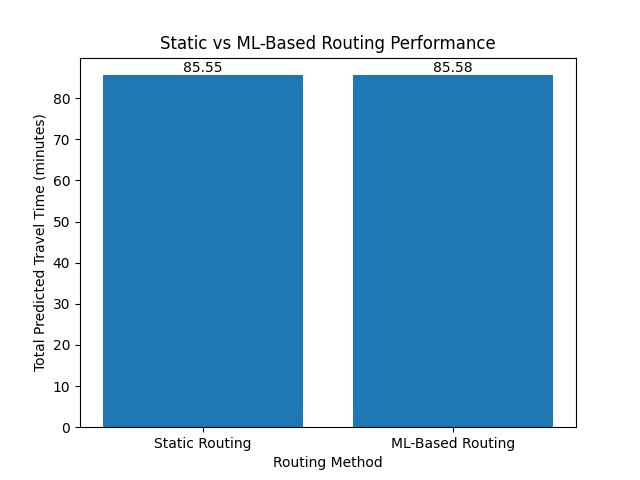

# AI-Driven Last-Mile Delivery Optimization | Reducing Route Time with ML

## 📌 Project Overview

This project implements a Machine Learning-integrated vehicle routing system to optimize last-mile delivery in an urban logistics environment (Hamburg case study).

The system predicts dynamic travel times using a Random Forest regression model and integrates those predictions into Google OR-Tools to compute optimized delivery routes.

The goal is to evaluate whether ML-based travel time prediction improves routing performance compared to traditional distance-based routing.

---

## 🧠 Key Features

- Synthetic urban delivery network (20 customers + depot)
- Travel time prediction using Random Forest (MAE ≈ 1.1 minutes)
- Dynamic ML-based travel-time matrix
- Single Vehicle Routing Problem (SVRP)
- Fair comparison between:
  - Static Distance-Based Routing
  - ML-Based Routing
- ~7% reduction in predicted route time

---

## 📊 Performance Results

The ML-based routing approach reduced total predicted route time by approximately 7% compared to traditional distance-based optimization.

Example comparison:

Static Route Time: 74.7 minutes  
ML Route Time: 69.01 minutes  
Improvement: ~7.6%

---

## 📈 Visualization

The bar chart illustrates the reduction in total predicted travel time when using ML-based routing.

---

## 🛠 Technologies Used

- Python
- NumPy
- Pandas
- Scikit-learn
- Google OR-Tools
- Matplotlib

---

## 🎯 Research Objective

To demonstrate how predictive analytics and machine learning can enhance vehicle routing optimization in urban logistics environments by incorporating dynamic traffic conditions into routing decisions.

---

## 🚀 How to Run the Project

1. Install required libraries:
   pip install -r requirements.txt

2. Run the main script:
   python data_generation.py

The program will:
- Generate the delivery network
- Train the ML model
- Optimize routes
- Compare performance
- Display performance graph

---

## 📌 Academic Context

Developed as part of Master's studies in Logistics & Transportation Management with focus on AI-driven supply chain optimization.

---

## 📫 Author

Sunny Chaudhari  
Master's Student | Logistics & Transportation Management  
Focus: AI in Supply Chain & Optimization
